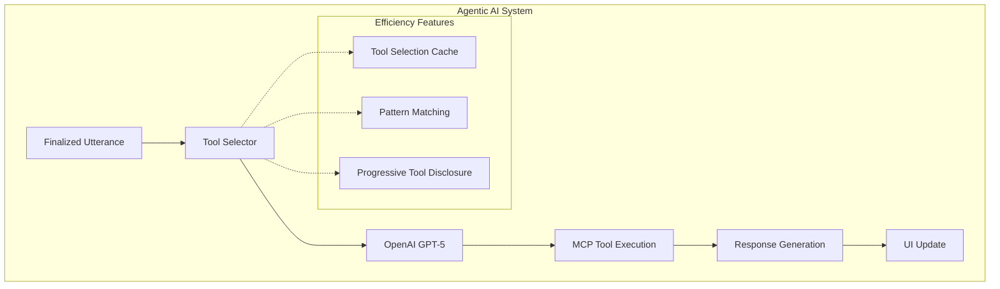

https://github.com/user-attachments/assets/43088bbd-ae97-4ec1-a7ed-7ef9e4cbedba


# Grainger Voice Product Assistant Demo
- Implements speech-to-text, LLM agentic tool calls, LLM generated response, and speech-to-text reading of the response.
- Provides detailed step-by-step real-time latency metrics and a best practices guide for future projects.

  
## Table of Contents
- [Documentation](#documentation)
- [Cluster Notice (vNext SNI Blocker)](#cluster-notice-vnext-sni-blocker)
- [Features](#features)
- [Session and Turn Management (v2)](#session-and-turn-management-v2)
- [Installation with UV](#installation-with-uv)
- [Dynamic Tool Discovery](#dynamic-tool-discovery)
- [Prerequisites](#prerequisites)
- [Running the Application](#running-the-application)
- [Agentic AI System](#agentic-ai-system)
- [Speech Recognition Components](#speech-recognition-components)
- [Utterance Boundary Handling (Hybrid)](#utterance-boundary-handling-hybrid)
- [Audio Transcription Flow (Code Path)](#audio-transcription-flow-code-path)
- [Testing](#testing)
- [Development Workflow](#development-workflow)
- [Deploy and Monitor](#deploy-and-monitor)


Voice-enabled product search and ordering system for industrial MRO supplies with intelligent AI agent integration.

## Features

- 🎤 Real-time speech recognition with Google Cloud Speech-to-Text v2 (streaming)
- ⏱️ Hybrid utterance boundary detection (confidence/timeouts + voice activity events + spaCy completeness) with interruption handling
- 🤖 **Agentic AI System** with OpenAI integration for intelligent query processing
  - Model chosen based on the research on latency and structured output available here: https://grainger-gtg-mlops-dev-use1-dbx-shared-ws.cloud.databricks.com/explore/data/ctlg_domain_dev_bronze/schm_product/llm_eval_latency_stats?o=2648165776397546&activeTab=overview
- 🔧 **Dynamic Tool Discovery** - Automatically discovers all available tools from MCP servers at startup
  - 25+ tools discovered from 10 MCP servers in milliseconds
  - Real-time UI status reporting
- 🛡️ **Tool Access Control** - Centralized restrictions for security and compliance
  - Order tools blocked by default (`ENABLE_ORDER_TOOLS=false`)
  - Easy to add new restricted categories
- 🛠️ **MCP Tool Integration** for product search, availability checking, and alternatives
- 🧠 **Real-time Thinking Display** showing AI reasoning process in the UI
- 🔍 Semantic product search via MCP tools
- 🔊 **Text-to-Speech (TTS)** - Google Cloud Neural2 voices read LLM responses aloud
  - Automatic markdown stripping for natural speech (removes headers, bold, lists, etc.)
  - Automatic microphone muting during playback to prevent feedback loop
  - Manual stop button for user interruption


## Documentation

- BEST_PRACTICES_IMPLEMENTED.md — Google STT v2 + agentic system best practices and TTS latency optimization.


## Session and Turn Management

### Definitions

- **Session**: A stable conversation container identified by `session_id`.
- **Turn**: One finalized utterance processed into one assistant response.
- **Trace**: One turn-level execution timeline identified by `trace_id`, composed of timed spans.

### Session identity

- The browser generates a UUID once and stores it in `localStorage`.
- On WebSocket connect, the browser sends a `hello` message containing the `session_id`.

### Session lifecycle and cleanup

- Sessions are kept in memory on the server.
- Sessions are expired after 15 minutes of inactivity (TTL cleanup).

### Where to review the implementation

- `src/gateway/webrtc_server.py`: WebSocket `hello` handling, turn boundary at utterance finalization, v2 trace events.
- `src/gateway/llm_integration.py`: Session manager, TTL cleanup, per-session aggregation.
- `src/llm/tracing_v2.py`: Trace/span primitives and session metrics aggregation.
- `src/gateway/tracing_protocol_v2.py`: WebSocket envelope for trace events and `hello` parsing.

## Installation with UV

This project uses [UV](https://github.com/astral-sh/uv), a modern Python package installer and resolver that's significantly faster than pip.

### Installing UV

```bash
# Install UV globally
pip install uv

# Or use our setup script which will install UV if needed
python setup_uv.py
```

### Setting Up the Project

```bash
# Navigate to project root (where pyproject.toml is located)
cd /path/to/Voice_Assistant

# Install dependencies and sync environment
uv sync

# Or use Makefile
make install

# Set up environment variables
cp .env.example .env
# Edit .env with your API keys and configuration
```

### Environment Configuration

Key environment variables to configure in `.env`:

```bash
# OpenAI Configuration
OPENAI_API_KEY=your_api_key_here
OPENAI_MODEL=gpt-4o
OPENAI_MAX_TOKENS=150          # Lower value used for fast responses
OPENAI_TEMPERATURE=0.2         # Lower = more deterministic

# MCP Server Configuration
MCP_BASE_URL=https://grainger-mcp-servers.svc.ue2.prod.mlops.prod.aws.grainger.com
MCP_AUTH_TOKEN=your_bearer_token_here

# Tool Access Control
ENABLE_ORDER_TOOLS=false       # Disable order tools by default (security)

# Google Cloud Speech-to-Text
GOOGLE_PROJECT_ID=your-project-id
MODEL_NAME=latest_long
GOOGLE_APPLICATION_CREDENTIALS=/path/to/service-account.json

ASR Mode
- Default: REST (synchronous, chunked) to work behind corporate firewalls.
- To switch to gRPC streaming after network approval: update `ASRModes.DEFAULT` in `src/constants/common_constants.py` to `ASRModes.GRPC` and redeploy.

Note:
- Local development: update and uncomment `GOOGLE_APPLICATION_CREDENTIALS` to your absolute local JSON path.
- Cluster deployment: set `GOOGLE_APPLICATION_CREDENTIALS=/secrets/gcp/service-account.json` (Helm mounts the secret there).
 - Switching ASR mode: change `ASRModes.DEFAULT` in code, not via env.

#### Configuration Model: .env vs code defaults
- .env (secrets and environment-specific toggles):
  - Secrets and endpoints: `OPENAI_API_KEY`, `MCP_AUTH_TOKEN`, `GOOGLE_APPLICATION_CREDENTIALS`, etc.
  - Safe runtime switches: `ENABLE_ORDER_TOOLS`, `MODEL_NAME`, `GOOGLE_PROJECT_ID`.
  - In Kubernetes, injected via the `voice-assistant-env` Secret.
- Code defaults (app behavior, requires rebuild):
  - `src/constants/common_constants.py` controls operation-level defaults (e.g., `ASRModes.DEFAULT`).
  - Default ASR transport is `REST` to work behind corporate firewalls. Change to `GRPC` only after network approval and redeploy.
  - Centralizes non-secret defaults (ASR/TTS defaults, model maps) to prevent accidental drift via env.

```

See [OPENAI_RESPONSE_CONFIGURATION.md](OPENAI_RESPONSE_CONFIGURATION.md) for detailed token configuration guidance.

## Dynamic Tool Discovery

The system automatically discovers all available tools from MCP servers at startup:

### How It Works

1. **Startup Discovery**: On application start, calls `/tools/discovery/all` endpoint
2. **Schema Transformation**: Converts MCP tool schemas to OpenAI function calling format
3. **Tool Filtering**: Applies access control restrictions based on environment variables
4. **UI Reporting**: Displays discovery status in the web interface

### Discovered Tools

**Typical discovery results:**
- **Total tools**: 25+ tools from 10 MCP servers
- **Available tools**: 24 (after filtering)
- **Restricted tools**: 1 (order tools blocked by default)

**Example tools discovered:**
- `get_product_docs` - Product search and retrieval
- `parse_customer_query` - Query parsing and entity extraction
- `get_category_description` - Category information
- `get_order_info` - ⚠️ **BLOCKED BY DEFAULT** (order information)

### Tool Access Control

For security and compliance, certain tool categories are restricted:

**Order Tools (Blocked by Default):**
- `get_order_info` - Retrieve order information
- `search_orders` - Search customer orders
- `update_order` - Modify orders
- `cancel_order` - Cancel orders
- `track_order` - Track order status

**Why blocked?**
- Prevents access to sensitive customer data
- Compliance with data privacy regulations
- Reduces security attack surface

**To enable order tools** (if needed):
```bash
# In .env
ENABLE_ORDER_TOOLS=true
```

See [TOOL_RESTRICTIONS.md](TOOL_RESTRICTIONS.md) for complete documentation on tool access control.

### Monitoring Tool Discovery

**Check discovery status:**
```bash
curl http://localhost:8000/tool-discovery-status
```

**Logs show:**
```
✅ Tool discovery complete: 24 tools from 10 servers in 2.34s
Loaded 24 dynamically discovered tools (1 restricted)
```

**UI displays:**
- Green panel: "✅ Tool discovery complete: 24 tools from 10 servers (2.3s)"
- Red panel: "⚠️ Tool discovery failed: Using fallback hardcoded tools"

See [DYNAMIC_TOOL_DISCOVERY.md](DYNAMIC_TOOL_DISCOVERY.md) for complete documentation.

```

### ⚠️ Important: Always Use UV Run

**Critical**: Always use `uv run` before Python commands to ensure the correct virtual environment and dependencies are used:

```bash
# ✅ Correct - Uses UV environment
uv run python script.py
uv run python verify_models.py
uv run python -c "import google.cloud.speech_v2; print('Import works')"

# ❌ Incorrect - Uses system Python, may cause import errors
python script.py
python verify_models.py
```

## Prerequisites

### Google Cloud SDK
Install Google Cloud SDK for model verification and project management:

```bash
# macOS
brew install --cask google-cloud-sdk

# Initialize and authenticate
gcloud init
gcloud auth login

# Verify installation and list available models
uv run python verify_models.py

# Test specific model with REST API
curl -X POST \
  "https://speech.googleapis.com/v2/speech:recognize" \
  -H "Authorization: Bearer $(gcloud auth print-access-token)" \
  -H "Content-Type: application/json" \
  -d '{
    "recognizer": "projects/gen-lang-client-0896931207/locations/global/recognizers/_",
    "config": {
      "autoDecodingConfig": {},
      "languageCodes": ["en-US"],
      "model": "latest_long"
    }
  }'
```

### Common Google Cloud Commands
Reference: https://docs.cloud.google.com/sdk/gcloud/reference/ml/speech

```bash
# Test available models with Python script
uv run python verify_models.py

# Test speech recognition with specific model
curl -X POST \
  "https://speech.googleapis.com/v2/speech:recognize" \
  -H "Authorization: Bearer $(gcloud auth print-access-token)" \
  -H "Content-Type: application/json" \
  -d '{
    "recognizer": "projects/gen-lang-client-0896931207/locations/global/recognizers/_",
    "config": {
      "autoDecodingConfig": {},
      "languageCodes": ["en-US"],
      "model": "MODEL_NAME"
    }
  }'

# Check project configuration
gcloud config list

# Set active project
gcloud config set project gen-lang-client-0896931207

# Print access token for API testing
gcloud auth print-access-token
```

### Available Models
Based on testing, the following models work with this project:
- `latest_long` - Best quality for general speech ✅
- `latest_short` - Fast, lower latency ✅  
- `telephony` - Optimized for phone audio ✅
- `medical_conversation` - Optimized for medical dictation ✅

### Alternative Installation
If you don't use Homebrew, download from: https://cloud.google.com/sdk/docs/install

### Development Setup

```bash
# Install development dependencies
uv sync --dev

# Or use our Makefile
make dev
```

## Running the Application

### WebRTC Voice Server

```bash
# Start the WebRTC voice gateway server
make run
# Or directly with uvicorn
uv run uvicorn src.gateway.webrtc_server:app --reload --host 0.0.0.0 --port 9999

# Access the voice interface
open http://localhost:9999

- Service endpoint (test environment): https://demo-voice-assistant-test.svc.ue2.prod.mlops.prod.aws.grainger.com
```

### Development Workflow

```bash
# Start the server in development mode (auto-restarts on changes)
make run

# Stop the server
# Press Ctrl+C in the terminal where the server is running

# Restart after making changes
# The server auto-restarts with --reload flag, or manually:
make run
```

### Testing and Debugging

```bash
# Test the WebRTC server with a Python client
uv run python test_webrtc_client.py

# Monitor server logs in real-time
# The server outputs logs to the terminal when running

# Test audio pipeline
# 1. Start server: make run
# 2. Open browser: http://localhost:9999
# 3. Click "Start Recording" and speak
# 4. Check server logs for transcription results
```

### Server Management

```bash
# Check if server is running
curl http://localhost:9999/health

# Find server process
ps aux | grep webrtc_server

# Force stop server (if needed)
pkill -f webrtc_server

# Clean restart after configuration changes
pkill -f webrtc_server
make run
```

## Agentic AI System

The voice assistant now includes an intelligent agentic system that processes finalized utterances through OpenAI GPT-5 with access to MCP tools for product search, availability checking, and more.

### Architecture Overview



### Key Components

1. **OpenAI Client** (`src/llm/openai_client.py`)
   - Handles GPT-5 API integration
   - Includes retry logic and error handling
   - Supports streaming responses

2. **MCP Tool Manager** (`src/llm/tool_manager.py`)
   - Manages 12 MCP tools for product operations
   - Handles tool execution and response formatting
   - Supports parallel tool execution

3. **Efficient Tool Selector** (`src/llm/tool_selector.py`)
   - Multi-layered tool selection strategy
   - Pattern-based matching for fast responses
   - LLM-based selection for complex queries
   - Intelligent caching to reduce API calls

4. **Agentic System** (`src/llm/agentic_system.py`)
   - Orchestrates the entire reasoning process
   - Manages conversation context
   - Tracks thinking states for UI display

5. **Error Handling** (`src/llm/error_handling.py`)
   - Circuit breaker pattern for resilience
   - Retry strategies with exponential backoff
   - Intelligent fallback responses

### UI Integration

The web interface displays real-time AI thinking:

- **Thinking Status**: Shows current AI processing state
- **Reasoning Steps**: Displays the AI's reasoning process
- **Confidence Levels**: Visual indicators of AI confidence
- **Tool Usage**: Shows which tools were used

### Environment Variables

Add these to your `.env` file for the agentic system:

```bash
# OpenAI Configuration
OPENAI_API_KEY=your_openai_api_key_here
OPENAI_MODEL=gpt-5
OPENAI_MAX_TOKENS=4000
OPENAI_TEMPERATURE=0.7
OPENAI_TIMEOUT=30

# MCP Server Configuration
MCP_BASE_URL=https://your-mcp-server.com
MCP_AUTH_TOKEN=your_mcp_auth_token
```

### Tool Capabilities

The agentic system has access to 12 MCP tools organized by function for lower token selection:

**Product Retrieval:**
- `get_product_docs` - Semantic product search
- `get_alternate_docs` - Find alternative products
- `get_compatible_docs` - Find compatible products
- `get_replacement_docs` - Find replacement products
- `get_raw_docs` - Get raw product data

**Availability:**
- `get_ship_availability_details` - Shipping availability
- `get_pickup_availability_details` - Store pickup availability
- `get_availability_by_intent` - Intent-based availability

**Information:**
- `parse_customer_query` - Extract SKUs/brands from text
- `get_category_description` - Product category info
- `get_product_url` - Generate product URLs
- `get_ln_filters_info` - Line number filter info

## Speech Recognition Components

## Utterance Boundary Handling (Hybrid)

This application uses a **hybrid utterance boundary strategy** to decide when a user is actually finished speaking (and therefore when it is safe to trigger downstream MCP/LLM actions).

Why this exists:
- Streaming ASR emits many partial hypotheses.
- Users pause mid-thought.
- Triggering tool calls too early produces incorrect searches/orders.

### Architecture

- Google Speech-to-Text v2 streaming produces **interim** and **final** updates and voice activity events.
- The server converts these into structured transcription events (see `TranscriptEvent`).
- `UtteranceManager` applies layered decision-making:
  - orchestrates transcript updates, scheduling, cancellation, and interruption handling
  - delegates boundary decision logic to `UtteranceBoundaryDecider`

- `UtteranceBoundaryDecider` applies layered decision-making:
  - confidence gating
  - adaptive multi-tier timeouts
  - lightweight heuristic completeness checks
  - optional syntactic completeness analysis (spaCy dependency parsing) for edge cases
  - a hard maximum timeout fallback

Implementation:
- `src/asr/base.py`: `TranscriptEvent`
- `src/asr/google_speech_v2.py`: emits transcript events when `emit_events=True`
- `src/gateway/utterance_boundary_decider.py`: hybrid boundary decision logic
- `src/gateway/utterance_manager.py`: orchestrates utterance lifecycle + scheduling
- `src/gateway/webrtc_server.py`: integrates `UtteranceManager` with WebRTC ingestion and emits UI state messages

### UI/Server State Messages

The server emits status events over WebSocket with a `state` field so the client can show whether it is:
- `listening`
- `processing`
- `thinking`
- `interrupted`
- `canceled`
- `done`

### Tuning knobs (environment variables)

You can tune the utterance boundary behavior without code changes:

- `UTT_SHORT_TIMEOUT_S` (default `1.5`)
- `UTT_MEDIUM_TIMEOUT_S` (default `3.0`)
- `UTT_LONG_TIMEOUT_S` (default `6.0`)
- `UTT_INCOMPLETE_TIMEOUT_S` (default `4.0`)
- `UTT_SEARCH_TIMEOUT_S` (default `3.5`)
- `UTT_CONFIDENCE_GOOD` (default `0.75`)
- `UTT_CONFIDENCE_HIGH` (default `0.90`)

Optional semantic layer:
- `UTT_DISABLE_SPACY_SEMANTIC` (default `0`)
- `UTT_SEMANTIC_CONFIDENCE_THRESHOLD` (default `0.85`)

Related Google Speech v2 segmentation settings:
- `GOOGLE_SPEECH_START_TIMEOUT_S` (default `5`)
- `GOOGLE_SPEECH_END_TIMEOUT_S` (default `1`)

### UI cue for finalized utterances

When the server emits a `final_transcript` (i.e., an utterance that is ready for downstream processing), the embedded WebRTC UI underlines that line in green and fades the underline away.

## Audio Transcription Flow (Code Path)

The diagrams below reflect the *actual* code flow for audio ingestion and transcription, split into:
- a *control plane* (startup/config)
- a *data plane* (runtime audio path)

```mermaid
flowchart TD
  subgraph Control[Control plane (startup/config)]
    CLI[make run] --> Env[MODEL_NAME + GOOGLE_PROJECT_ID + ADC credentials]

    Env --> SessionInit[AudioSession init\n(reads env vars)]
    SessionInit --> Factory[ASRFactory.create_provider()]
    Factory --> Provider{provider_type}
    Provider -->|google_speech_v2| GSV2[GoogleSpeechV2Provider.initialize()] 
  end
```

```mermaid
flowchart TD
  subgraph Data[Data plane (runtime audio path)]
    Browser[Browser] --> WS[/WebSocket /ws/]
    WS --> PC[RTCPeerConnection]
    PC --> Recv[AudioTrackProcessor.recv()]
    Recv --> Session[AudioSession.process_audio()]

    Session --> Stream[stream_audio()]
    Stream --> Worker[_streaming_worker()]
    Worker --> Callbacks[interim_callback / transcription_callback]
    Callbacks --> Send[websocket.send_json()\n(partial + final + metrics)]
    Send --> Browser
  end
```

Legend:
- `MODEL_NAME` must be a valid Speech-to-Text v2 model name (for example `latest_long`, `latest_short`).

Key implementation files:
- `src/gateway/webrtc_server.py`:
  - `websocket_endpoint()`
  - `AudioTrackProcessor.recv()`
  - `AudioSession.process_audio()`
  - `_on_interim_transcript()` / `_on_final_candidate_transcript()`
- `src/asr/google_speech_v2.py`:
  - `GoogleSpeechV2Provider.start_streaming()` / `stream_audio()` / `_streaming_worker()`
- `src/asr/base.py`:
  - ASR provider selection via `ASRFactory`


### Automatic Speech Recognition (ASR)

This project uses Google Cloud Speech-to-Text v2 in streaming mode.

#### Available Models

Valid Speech-to-Text v2 models:
- `latest_long` - Best quality for general speech
- `latest_short` - Faster, lower latency
- `telephony` - Optimized for phone audio
- `medical_conversation` - Optimized for medical dictation
- `chirp` - High quality (availability may vary)
- `chirp_2` - Best quality (availability may vary)

#### Usage Examples

```bash
# List all available models
make models

# Run with a specific Speech-to-Text v2 model
MODEL_NAME=latest_long make run
```

## Testing

```bash
# Check if all required dependencies are installed
make check-deps

# Install all required dependencies
make install-deps

# Run all tests (will check dependencies first)
make test

# Run all tests in CI mode (no dependency checks)
make test-ci

# Run specific test suites
make test-vad

# Run tests directly with pytest
pytest tests/ -v
pytest tests/asr/test_vad.py -v
```

### Dependency Management for Tests

This project ensures that all required dependencies are installed before running tests:

1. **Automatic Dependency Checking**: The test runners check for required dependencies before running tests
2. **Interactive Installation**: In interactive mode, you'll be prompted to install missing dependencies
3. **Auto-Installation**: Use the `--auto-install` flag to automatically install missing dependencies
4. **CI Mode**: In CI environments, use the `--ci` flag to automatically install dependencies without prompts
5. **Fail-Fast**: Tests will fail rather than skip when dependencies are missing, ensuring code quality

## Development Workflow

```bash
# Format code
make format

# Lint code
make lint

# Clean up cache files
make clean
```


## Deploy and Monitor
```bash
# Deploy
update test.yaml in the helm folder with the Sha from the pushed build. 

In the terminal sign in: 
assume

helm upgrade {name-from-test.yaml} ./helm -f helm/values/test.yaml --install
i.e. helm upgrade demo-voice-assistant-test ./helm -f helm/values/test.yaml --install

# Verify deployment
helm list
kubectl get pods
kubectl logs {pod-name} -f

# Access your deployment
kubectl get ingress
# Access via: https://{your-ingress}.aad.devaws.grainger.com/ping
e.g. 
# VPN required
```

#### Inject .env into Pods

Update secrets and restart deployment to apply changes.

Commands:
- Create/update secrets:
```bash
  kubectl delete secret voice-assistant-env -n digitalassistantdomain
  kubectl create secret generic voice-assistant-env --from-env-file=.env -n digitalassistantdomain
```
- Restart deployment:
```bash
  kubectl rollout restart deploy/demo-voice-assistant-test -n digitalassistantdomain
  kubectl rollout status deploy/demo-voice-assistant-test -n digitalassistantdomain --timeout=5m
```
- Verify:
```bash
  POD_NAME=$(kubectl get pod -n digitalassistantdomain -l app=demo-voice-assistant -o jsonpath='{.items[0].metadata.name}')
  kubectl exec -it $POD_NAME -n digitalassistantdomain -- env | grep GOOGLE_APPLICATION_CREDENTIALS
```

• GCP Speech credentials (one-time):
  kubectl create secret generic gcp-speech-sa --from-file=service-account.json=./gen-lang-client-0896931207-25ea0adb448d.json -n digitalassistantdomain

• Helm mounts this secret at `/secrets/gcp`; add to env secret:
  GOOGLE_APPLICATION_CREDENTIALS=/secrets/gcp/service-account.json

• Verify in pod:
  POD_NAME=$(kubectl get pod -n digitalassistantdomain -l app=demo-voice-assistant -o jsonpath='{.items[0].metadata.name}')
  kubectl exec -it $POD_NAME -n digitalassistantdomain -- ls -la /secrets/gcp/
  kubectl exec -it $POD_NAME -n digitalassistantdomain -- printenv | grep -E 'GOOGLE_APPLICATION_CREDENTIALS($|_)'

##### To view logs for the deployment, 
1. Go to the grafana link for qa/prod depending on the deployment environment.  
  PROD -> https://grafana.prod.mlops.prod.aws.grainger.com/explore?schemaVersion=1&panes=%7B%22zt5%22%3A%7B%22datasource%22%3A%22P8E80F9AEF21F6940%22%2C%22queries%22%3A%5B%7B%22refId%22%3A%22A%22%2C%22expr%22%3A%22%7Bapp%3D%5C%22demo-voice-assistant-test%5C%22%7D+%7C%3D+%60%60%22%2C%22queryType%22%3A%22range%22%2C%22datasource%22%3A%7B%22type%22%3A%22loki%22%2C%22uid%22%3A%22P8E80F9AEF21F6940%22%7D%2C%22editorMode%22%3A%22builder%22%7D%5D%2C%22range%22%3A%7B%22from%22%3A%22now-1h%22%2C%22to%22%3A%22now%22%7D%7D%7D&orgId=1


#### Cleanup
```bash
helm uninstall {name-from-test.yaml}
```
